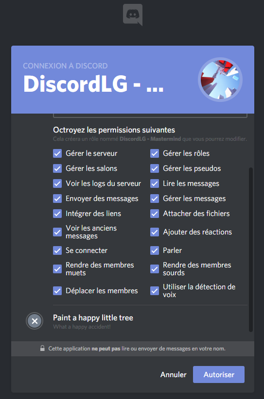
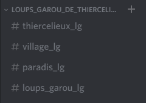

# LGDB - Loup Garou Discord Bot

## Permissions nécessaires



## Informations très importantes


### Le bot réquisitionne des noms spécifiques de channels et de rôles

#### Noms de rôles utilisés par le bot

Assurez-vous de ne pas déjà avoir sur votre serveur des rôles importants nommés respectivement :

* _**JoueurLG**_ Rôle des joueurs vivants de la partie de loup garou
* _**MortLG**_ Rôle des joueurs morts de la partie de loup garou
* _**MastermindLG**_ Rôle attribué au meneur de jeu \(le bot\) pour avoir la vision totale sur la partie de loup garou

#### Noms de channels utilisés par le bot

Voici les channels que le bot générera si ils ne sont pas présents sur le serveur, ou utilisera directement si ils sont déjà présents sur le serveur  :

* _**thiercelieux\_lg**_ Channel où se passent les annonces et les référendums
* _**village\_lg**_ Channel du village, où les joueurs se rencontrent et discutent
* _**paradis\_lg**_ Channel des morts, où les joueurs défunts discutent au paradis
* _**loups\_garou\_lg**_ Channel des loups garous, où les loups se concertent pour désigner leurs proies




## [Ajouter le bot à son serveur discord](https://discordapp.com/api/oauth2/authorize?client_id=538344945673830410&scope=bot&permissions=468839664)

```text
Bot en cours de développement, Beta 1.0
```


[Cliquez-ici](https://discordapp.com/api/oauth2/authorize?client_id=538344945673830410&scope=bot&permissions=468839664) pour ajouter le bot à votre serveur


## Objectifs

L'objectif du bot est de pouvoir animer une session du jeu Loup garou. 

Le bot est capable de gérer tous les rôles existant sur Wikipédia, et et est paramétrable afin de définir les règles de la partie \(nombre de villageois, nombre de loup, etc.\).

Le bot distribue de manière équitable et aléatoire les rôles ; enfin, le bot anime la partie.

## Rappel des règles du jeu de Loup Garou

**Les Loups-Garous de Thiercelieux** est un [jeu de société](https://fr.wikipedia.org/wiki/Jeu_de_soci%C3%A9t%C3%A9) d'ambiance dans lequel chaque joueur incarne un villageois ou un [loup-garou](https://fr.wikipedia.org/wiki/Lycanthrope), et dont le but général est :

* pour les villageois \(dont certains ont des pouvoirs ou des particularités\) : démasquer et tuer tous les loups-garous
* pour les loups-garous : d'éliminer tous les villageois et ne pas se faire démasquer
* pour les amoureux : de finir la partie en couple sans que l'un d'eux ne meure \(auquel cas l'autre se « suicidera » de chagrin\)

## Normes


### Programmation Orientée Objet

Pour le développement de ce jeu, une approche orientée objet paraît nécessaire. Le Javascript permet ce paradigme de programmation, c'est donc celui utilisé lors du développement de ce jeu.



### ES6

 La norme utilisé est la **norme ES6**, ce qui induit notamment les **arrow function**, les **promises**, et le **async**/**await**. Une bonne connaissance de ces notions est nécessaire au développement de ce jeu. L'**événementiel** et le **parallélisme** sont des éléments clés qui se retrouvent dans le code.



### Discord.js

[La bibliothèque discord.js](https://discord.js.org) est celle utilisé pour le bot, compatible avec les normes mentionnées précédemment.


